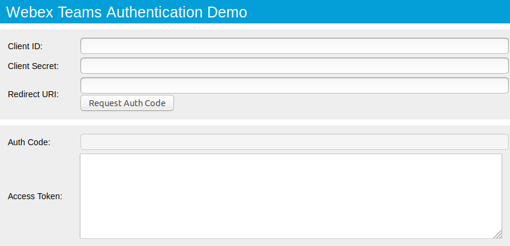

# A simple application demonstrating retrieving a Cisco Common Identity SSO token for use with Spark API

# Cisco Spark Web Application Authentication

**Description**:  A simple application demonstrating how to retrieve a Cisco Spark OAuth2 token for use with the Cisco Spark API.

  - **Technology stack**: HTML/Javascript
  - **Status**:  First release v1.1 [CHANGELOG](CHANGELOG.md).
  - **Live Demo**: This sample code accompanies the 'Spark - Application Registration and Authentication' learning lab at https://learninglabs.cisco.com

**Screenshot**: 

## Installation

The HTML page must be served from a web browser (vs. the local file system)

## Usage

- Register a Spark application at https://developer.ciscospark.com/apps.html
- Note, the application URL provided during registration should be the URL where this sample app page will be hosted
- The application Client ID and Client Secret generated during registration are required to run the app

## Getting help

Cisco DevNet support is available here: https://developer.cisco.com/site/devnet/support/

## Getting involved

Suggestions and enhancements welcome, see [CONTRIBUTING](CONTRIBUTING.md).

----

## Open source licensing info
[LICENSE](LICENSE)
